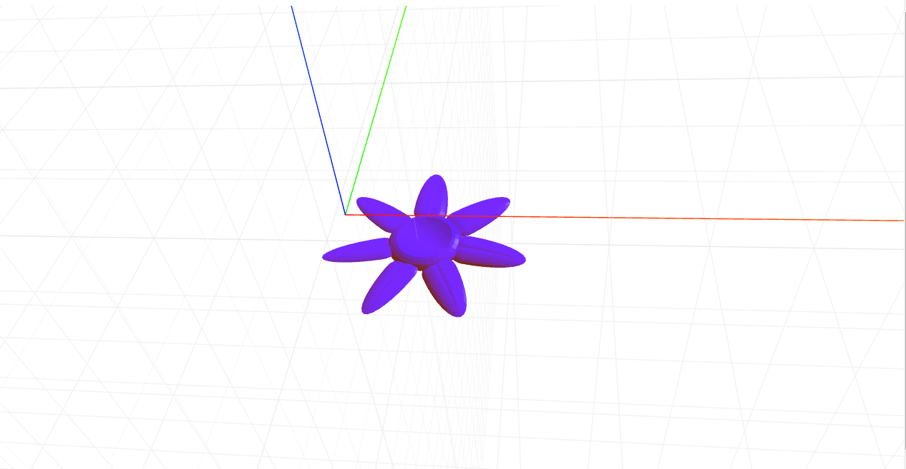

# craft-flower
Flower.

#Install
`$ npm install craft-flower`

#Parameters
`numberOfPetals - determines the number of petals. \n
petalLength - determines the length of a petal. \n
flowerRadius - determines the radius of the flower bud.`

#Example
```html
<craft>
	<craft name="flower" module="craft-flower">
	<flower numberOfPetals="15"></flower>
</craft>
```

